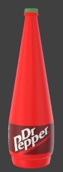

# Web-3D-Assignment-Submission
This is the web 3D submission of 246738 student in Sussex University in 2023

# gary_app_h5
https://users.sussex.ac.uk/~kh503/3dapp/assignment/gary_app_h5-main/index.html
# threejs
Using Threejs way to input the gltf model and the animation model
- The pros of Threejs
- 1, Easy to Use: Three.js provides a high-level abstraction over WebGL
- 2, Cross-platform Compatibility: Three.js is designed to work across multiple platforms and devices
- 3, Wide Range of Functionality: Three.js offers a rich set of features and functionality for creating 3D graphics and animations
- 4, Active Community and Documentation: Three.js has a large and active community of developers, artists, and enthusiasts who contribute to its development and provide support
- 5, Performance Optimization: Three.js incorporates various performance optimization  techniques to ensure smooth rendering of 3D scenes
- 6, Integration with other Libraries: Three.js can be easily integrated with other JavaScript libraries and frameworks, such as jQuery or React
- 7, Active Development and Updates: Three.js is actively maintained and updated, ensuring that developers have access to the latest features, bug fixes, and performance improvements
# VR

- Support VR ( Without VR settings you can install the webXR plugin from Google Chrome, Press F12 and enter plugin controll function )

# gary_app_server
Backend server used
- php 8.0
- composer
- laravel

# Back End Explaination

Using php 8 or higher version, composer is needed to be installed
The settings of pdo_sqlite needs to be matched the php.ini in order to support sqlite data storage
Using laravel set up

# models

